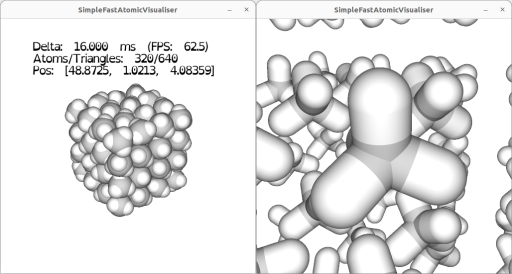

```
 ________  ________ ________  ________  ___      ___
|\   ____\|\  _____\\   __  \|\   __  \|\  \    /  /|
\ \  \___|\ \  \__/\ \  \|\  \ \  \|\  \ \  \  /  / /
 \ \_____  \ \   __\\ \  \\\  \ \   __  \ \  \/  / /
  \|____|\  \ \  \_| \ \  \\\  \ \  \ \  \ \    / /
    ____\_\  \ \__\   \ \_______\ \__\ \__\ \__/ /
   |\_________\|__|    \|_______|\|__|\|__|\|__|/
   \|_________| SimpleFastOpenAtomicVisualiser
```

# About

SimpleFastOpenAtomicVisualiser (SFOAV) is intented to enable fast visualisation of atomic and molecular structure files and trajectories.

It is an MIT licensed C++ project hosted here [https://github.com/JerboaBurrow/SimpleFastOpenAtomicVisualiser/](https://github.com/JerboaBurrow/SimpleFastOpenAtomicVisualiser). The visualisations are produced using OpenGL 3.3. There are options for "ray-traced" atoms and bonds or procedural meshes.

You can find the latest html Doxygen docs at [https://jerboaburrow.github.io/SimpleFastAtomicVisualiser/](https://jerboaburrow.github.io/SimpleFastAtomicVisualiser/).

The UI will be very unstable until 0.1.X, expect many breaking changes until then.

{text-align: center, html: width=50%, latex: width=8cm}

# Quickstart

To render a structure file ```struct.xyz``` simply call

```shell
sfoav struct.xyz
```

> [!important]
> SFOAV can process ```.xyz```, ```.extxyz```, and DL_POLY ```CONFIG```, ```REVCON``` and ```HISTORY``` files. If the file name does not match these patterns all types will be attempted.

This will bring up the view centring the atoms in ```struct.xyz``` in the first frame (if applicable). The camera is centered on (0, 0, 0) and can be moved in spherical coordinates relative to it. The atoms can also be translated relative to (0, 0, 0).

> [!note]
> Reading of structure files is done in a background thread. For large structure files you may be presented with a loading screen. An intel i7-4790K and Kingston A400 SATA SSD is capable of around 1,000,000 (positions only) atoms per second read.

If the structure file is a trajectory you may scan through its frames moving forward of backward in time using F and B respectively.

> [!note]
> When reading HISTORY files or XYZ/EXTXYZ with multiple frames, SFOAV will cache the filepositions (not data) of each frame in the background. For large trajectory files this may take some time, but you will always be able to play up to the most recently cached frame.

At runtime the following key-controls can be used:

| Key | Action  | Note |
| :----- | :---- | :---- |
| H      | Toggle atom drawing.    | |
| W      | Zoom towards the origin. | |
| S      | Zoom away from the origin. | |
| Q      | Incline the view. | |
| E      | Decline the view. | |
| A      | Rotate the view. | |
| D      | Rotate the view. | |
| LEFT   | Translate the atoms in -x | |
| RIGHT  | Translate the atoms in +x | |
| UP     | Translate the atoms in +z | |
| DOWN   | Translate the atoms in -z | |
| .      | Translate the atoms in -y | |
| /      | Translate the atoms in +y | |
| SPACE  | Reset to the default view and atom positions | At (0,0,0), azimuth Pi/2 and inclination Pi. |
| F      | Move forward in time  | |
| B      | Move backward in time | |
| 1 to 9 | Toggle element emphasis | Elements assigned at startup. |
| X      | Toggle coordinate axes | |
| C      | Toggle simulation cell | |
| ESC    | Quit | |

To enable MSAA at 16x

```shell
sfoav struct.xyz -msaa 16
```

To draw bonds between atoms 1.5 Angstroms apart

```shell
sfoav struct.xyz -bondCutOff 1.5
```

## Performance

For a system with an intel i7-4790K, Kingston A400 SATA SSD, a GTX 1080 ti, and 16 GB available RAM. SFOAV is capable of rendering at least 5,000,000 static atoms at 60 frames per second with 16x MSAA and with a moveable camera. At this scale moving the atoms will run cause drops to 30 fps, and frame increments will cost ~5 seconds.

## Meshes

> [!tip]
> Meshes are much slower than the ray-traced elements due to higher triangle counts.

To render using meshes at 10 levels of detail

```shell
sfoav struct.xyz -levelOfDetail 10 -meshes
```

To render with only Tetrahedral bases meshes at 5 levels of detail

```shell
sfoav struct.xyz -levelOfDetail 5 -meshes -mesh 4
```

The available meshes are.

| Mesh | value of -meshe  | Note |
| :----- | :---- | :---- |
| ICOSAHEDRON | 0 ||
| OCTAHEDRON | 1 ||
| DODECAHEDRON | 2 | Known issues at higher LOD|
| CUBE | 3 |Known issues at higher LOD|
| TETRAHEDRON | 4 ||
| TRIAUGMENTED_TRIANGULAR_PRISM | 5 | Known issues at higher LOD|
| ANY | 6 | Uses all mesh types controlled by LOD|

The maximum level of detail is 7 for invidual meshes and 23 for ANY. This is the number of refinements to the mesh or for ANY refinements for all meshes ordered by triangle count.