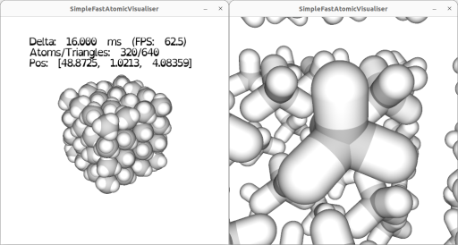

```
 ________  ________ ________  ________  ___      ___
|\   ____\|\  _____\\   __  \|\   __  \|\  \    /  /|
\ \  \___|\ \  \__/\ \  \|\  \ \  \|\  \ \  \  /  / /
 \ \_____  \ \   __\\ \  \\\  \ \   __  \ \  \/  / /
  \|____|\  \ \  \_| \ \  \\\  \ \  \ \  \ \    / /
    ____\_\  \ \__\   \ \_______\ \__\ \__\ \__/ /
   |\_________\|__|    \|_______|\|__|\|__|\|__|/
   \|_________| SimpleFastOpenAtomicVisualiser
```

# About

SimpleFastOpenAtomicVisualiser (SFOAV) is intented to enable fast visualisation of atomic and molecular structure files and trajectories.

It is a GPL licensed C++ project hosted here [https://github.com/JerboaBurrow/SimpleFastOpenAtomicVisualiser/](https://github.com/JerboaBurrow/SimpleFastOpenAtomicVisualiser). The visualisations are produced using OpenGL 3.3. There are options for "ray-traced" atoms and bonds or procedural meshes.

You can find the latest html Doxygen docs at [https://jerboaburrow.github.io/SimpleFastAtomicVisualiser/](https://jerboaburrow.github.io/SimpleFastAtomicVisualiser/).

The UI will be very unstable until 0.1.X, expect many breaking changes until then.

{text-align: center, html: width=50%, latex: width=8cm}

# Quickstart

To render a structure file ```struct.xyz``` simply call

```shell
sfoav struct.xyz
```

> [!important]
> SFOAV can process ```.xyz```, ```.extxyz```, and DL_POLY ```CONFIG```, ```REVCON``` and ```HISTORY``` files. If the file name does not match these patterns all types will be attempted.

This will bring up the view centring the atoms in ```struct.xyz``` in the first frame (if applicable). The camera is centered on (0, 0, 0) and can be moved in spherical coordinates relative to it. By defaul the atoms are centred at (0, 0, 0). The atoms can also be translated relative to (0, 0, 0).

> [!note]
> Reading of structure files is done in a background thread. For large structure files you may be presented with a loading screen. An intel i7-4790K and Kingston A400 SATA SSD is capable of around 500,000 (positions only) atoms per second read.

If the structure file is a trajectory you may scan through its frames moving forward of backward in time using F and B respectively. Or auto-playing/pausing with P.

> [!note]
> When reading HISTORY files or XYZ/EXTXYZ with multiple frames, SFOAV will cache the filepositions (not data) of each frame in the background. For large trajectory files this may take some time, but you will always be able to play up to the most recently cached frame.

At runtime the following camera key-controls can be used:

| Key | Action  | Note |
| :----- | :---- | :---- |
| W      | Zoom towards the origin. | |
| S      | Zoom away from the origin. | |
| Q      | Incline the view. | |
| E      | Decline the view. | |
| A      | Rotate the view. | |
| D      | Rotate the view. | |
| SPACE  | Reset to the default view and atom positions | At (0,0,0), azimuth Pi/2 and inclination Pi. |

The following atom key-controls are available:

| Key | Action  | Note |
| :----- | :---- | :---- |
| H      | Toggle atom drawing.    | |
| LEFT   | Translate the atoms in -x | |
| RIGHT  | Translate the atoms in +x | |
| UP     | Translate the atoms in +z | |
| DOWN   | Translate the atoms in -z | |
| .      | Translate the atoms in -y | |
| /      | Translate the atoms in +y | |
| 1 to 9 | Toggle element emphasis | Elements assigned at startup. |

Trajectory playback may be controlled by the following key-bindings:
| Key | Action  | Note |
| :----- | :---- | :---- |
| F      | Move forward in time  | Sets forwarding playing with P. |
| B      | Move backward in time | Sets backward playing with P. |
| P      | Pause/Play a trajectory | |
| J      | Decrease play speed | The minimum is 1 frame per second. |
| K      | Increase play speed | The maximum is 60 frames per second. |
| R      | Reset to the first trajectory frame | |

Miscellaneous key bindings are:
| Key | Action  | Note |
| :----- | :---- | :---- |
| X      | Toggle drawing the coordinate axes | |
| C      | Toggle drawing the simulation cell | |
| I      | Toggle information text | |
| V      | Start or finish a video recording | |
| ESC    | Quit | |

To enable MSAA at 16x

```shell
sfoav struct.xyz -msaa 16
```

To draw bonds between atoms 1.5 Angstroms apart

```shell
sfoav struct.xyz -bondCutOff 1.5
```

## Lua scripting

It is possible to write Lua scripts to manipulate visualisation in SFOAV. By supplying a path as ```-script PATH.lua``` to a Lua file, SFOAV will run the file each frame update. The console exports the following methods in the sfoav library.

> [!warning]
> Lua indexes from 1, but all sfoav library functions index from 0.

| Method | Arguments  | Return/Effect |
| :----- | :---- | :---- |
| setAtomColour  | Atom index and an RGB/RGBA colour, in [0, 1] | |
| getAtomColour  | Atom index | The atoms RGBA colour |
| bond           | Atom index a, Atom index b | Bond atoms a and b |
| unbond         | Atom index a, Atom index b | Unbond atoms a and b |
| getAtomsBonds  | Atom index a | A table of all atom indices bonded to a|
| getAtom        | Atom index a | The Atom structure for a |
| atomCount      | | The number of atoms |
| getAtomsNeighbours | Atom index x, cutoff distance | The neighbours of a within the cutoff |
| setText | Text string | Set the text display |
| getFrame | | The current frame number (from 0) |
| startRecording | | Start video recording if not already recording |
| stopRecording | | Stop video recording if already recording |
| play | | Play the trajectory |
| pause | | Pause playing the trajectory |
| cameraPosition | Bool for spherical coordinates | Get the camera's position |
| setCameraPosition | r, theta, phi spherical coordinates | Set the camera's position |
| rotateCamera | dphi, the azimuthal increment | Rotate the camera |
| zoomCamera | dr, move the camera to or from the focus | Zoom the camera |
| inclineCamera | dtheta, the inclination increment | Incline the camera |
| exit | | Exit sfoav |

E.g. the following script will set Atom 0 to a random colour every frame.

```lua
-- Set atom 0 to a random colour.
sfoav.setAtomColour(0, math.random(), math.random(), math.random())
```

Or a more complex example to render only the neighbours of atom 0 within 4 Angstroms

```lua
-- Get atom 0's neighbours up to 4 Angstroms.
neighbours = sfoav.getAtomsNeighbours(0, 4.0)

-- Fade all atoms.
for i = 1, sfoav.atomCount() do
    r, g, b, a = sfoav.getAtomColour(i-1)
    sfoav.setAtomColour(i-1, r, g, b, 0.0)
end

-- Unfade all neighbours to atom 0 within 4 Angstroms.
for i = 1, #neighbours do
    r, g, b, a = sfoav.getAtomColour(neighbours[i]["index"])
    sfoav.setAtomColour(neighbours[i]["index"], r, g, b, 1.0);
end
```

Another example for automated video rendering

```lua
if (record == nil) then
    -- Will only run once.
    record = true
    sfoav.inclineCamera(3.14*0.25)
    -- Begins recording.
    sfoav.startRecording()
    -- Begins trajectory playing.
    sfoav.play()
end

if (record and sfoav.getFrame() == 200) then
    -- At frame 200 finish recording and exit when done.
    sfoav.stopRecording()
    sfoav.pause()
    -- Exit will occur after frames are written.
    sfoav.exit()
    -- Ensure no duplicate calls.
    record = false
end
```

## Video

On macOS and Windows one release exists using jo_mpeg to write mp4 files.

On Linux two releases exist, the standalone ```sfoav``` which uses jo_mpeg for video writing, and the FFmpeg enabled version ```sfoav-ffmpeg``` which requires additional runtime dependencies (FFmpeg). The FFmpeg video quality is generally superior.

Videos are written out with the filename as the current timestamp.

Video frames are recorded at 60 fps whenever the camera or atoms are updated e.g. a new trajectory frame, new colours, camera moved etc.

Frames are written in the background which will impact visualisation frame rate.

For FFmpeg the ```-codec``` option accepts strings as seen via ```ffmpeg -codecs``` e.g. ```-codec nvenc_h264 -qp 21 -preset lossless``` for Nvidia's H264 encoder. Quality may be controlled by ```-preset```, as well as (depending on the codec) the ```-cp```, ```-crf```, and ```-qp``` arguments where 0 is best and 51 is worst. Other FFmpeg options are ```-bitrate``` and ```-maxBFrames``` and ```-gopSize```.

## Performance

For a system with an intel i7-4790K, Kingston A400 SATA SSD, a GTX 1080 ti, and 16 GB available RAM. SFOAV is capable of rendering at least 5,000,000 static atoms at 60 frames per second with 16x MSAA and with a moveable camera. At this scale moving the atoms will run cause drops to 30 fps, and frame increments will cost ~5 seconds.

Transparency sorting is on by default, if there are transparent atoms/bonds. This is expensive for the CPU on camera movements or atom/bond changes. This can be disabled with ```-noTransparencySorting```, but will render atoms/bonds out of order.

## Meshes

> [!tip]
> Meshes are much slower than the ray-traced elements due to higher triangle counts.

To render using meshes at 10 levels of detail

```shell
sfoav struct.xyz -levelOfDetail 10 -meshes
```

To render with only Tetrahedral bases meshes at 5 levels of detail

```shell
sfoav struct.xyz -levelOfDetail 5 -meshes -mesh 4
```

The available meshes are.

| Mesh | value of -meshe  | Note |
| :----- | :---- | :---- |
| ICOSAHEDRON | 0 ||
| OCTAHEDRON | 1 ||
| DODECAHEDRON | 2 | Known issues at higher LOD|
| CUBE | 3 |Known issues at higher LOD|
| TETRAHEDRON | 4 ||
| TRIAUGMENTED_TRIANGULAR_PRISM | 5 | Known issues at higher LOD|
| ANY | 6 | Uses all mesh types controlled by LOD|

The maximum level of detail is 7 for invidual meshes and 23 for ANY. This is the number of refinements to the mesh or for ANY refinements for all meshes ordered by triangle count.

## Colouring

It is possible to set the colour map taking Elements into RGBA values. This can be done by specifying a partial list in a file and supplying the CLI argument ```-colourmap YOUR_FILE_PATH```. An example file is

```
Ar 1.0 0.0 0.0 1.0
F  0.0 0.0 0.0 1.0
Cl 0.1 0.9 0.1 1.0
```

It is also possible to set the colour of individual atoms by their index in the structure file and suppling the CLI argument ```-atomColours YOUR_FILE_PATH```. These will override any other colour specifications for that atom. An example file is

```
0 1.0 0.0 0.0 1.0
3758 0.0 1.0 0.0 1.0
92 0.0 0.0 1.0 1.0
```